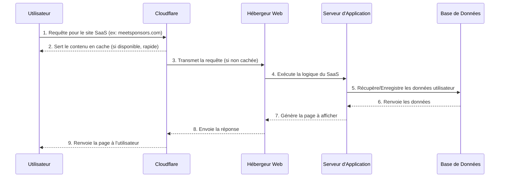
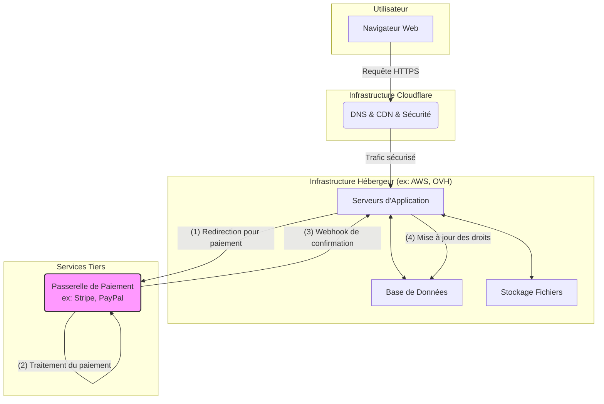

Bien sûr, voici deux diagrammes Mermaid qui illustrent l'architecture d'un site SaaS hébergé derrière Cloudflare, en incluant les hébergeurs traditionnels et le système de facturation.

-----

### Diagramme 1 : Flux de l'Utilisateur vers le Site

Ce diagramme montre le parcours d'un utilisateur depuis son navigateur jusqu'aux serveurs de l'application, en passant par Cloudflare.

**Explication du diagramme :**

1.  **Utilisateur vers Cloudflare :** Toute requête de l'utilisateur est d'abord interceptée par Cloudflare.
2.  **Mise en Cache :** Cloudflare peut directement répondre avec des éléments statiques (images, CSS, JavaScript) mis en cache, ce qui accélère considérablement le chargement.
3.  **Transmission :** Si la requête nécessite une logique métier (ex: connexion, accès au tableau de bord), Cloudflare la transmet de manière sécurisée à l'hébergeur réel.
4.  **Traitement :** L'**Hébergeur Web** (ex: OVH, AWS, Google Cloud) fait tourner le **Serveur d'Application** (le code du SaaS) qui interagit avec la **Base de Données** pour gérer les informations spécifiques à l'utilisateur.
5.  **Retour :** La réponse remonte le chemin inverse, est potentiellement mise en cache par Cloudflare, puis est délivrée à l'utilisateur.

-----

### Diagramme 2 : Architecture et Flux de Facturation

Ce diagramme montre comment les différents composants interagissent, en se concentrant sur le processus de facturation, qui est crucial pour un SaaS.

**Explication du diagramme :**

  * **Infrastructure :** L'**Utilisateur** interagit avec le site via **Cloudflare (B)**. Ce dernier protège et accélère l'accès à l'infrastructure principale hébergée chez un fournisseur comme AWS ou OVH. Cette infrastructure contient les **serveurs d'application (C)**, la **base de données (D)**, et le **stockage (E)**.
  * **Processus de Facturation :**
    1.  Quand un utilisateur décide de s'abonner, le **serveur d'application (C)** le redirige vers une **passerelle de paiement sécurisée (F)** comme Stripe.
    2.  Le paiement est entièrement traité par ce service tiers, ce qui est beaucoup plus sécurisé et simple pour le SaaS.
    3.  Une fois le paiement réussi, la passerelle envoie une confirmation automatique (un "webhook") au **serveur d'application (C)**.
    4.  En recevant cette confirmation, le serveur met à jour les informations de l'utilisateur dans la **base de données (D)** pour lui donner accès aux fonctionnalités premium.
